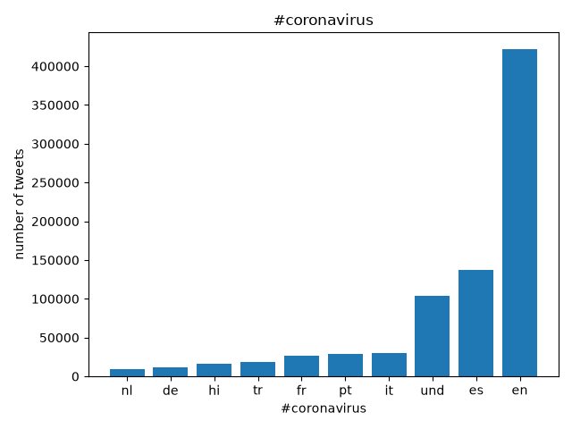
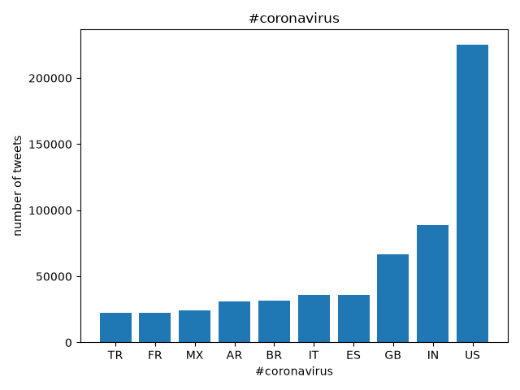
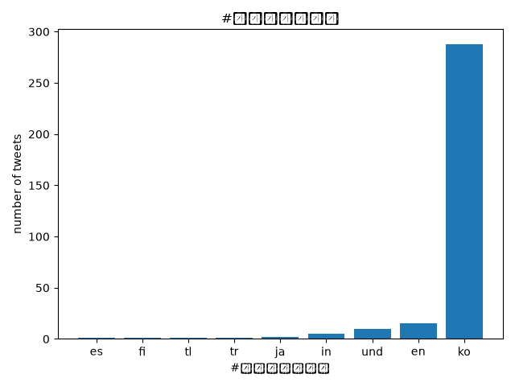
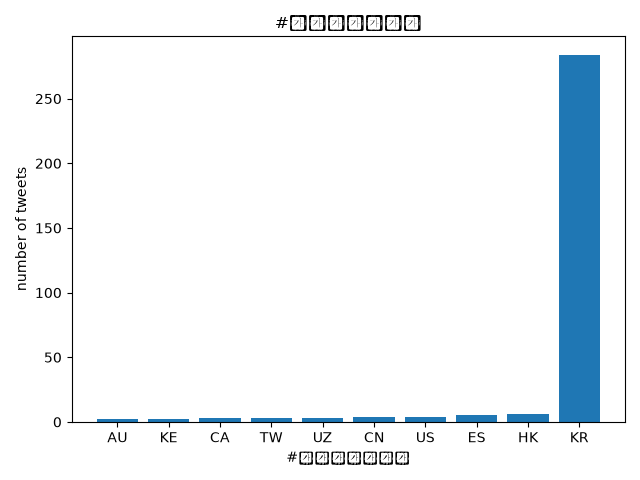
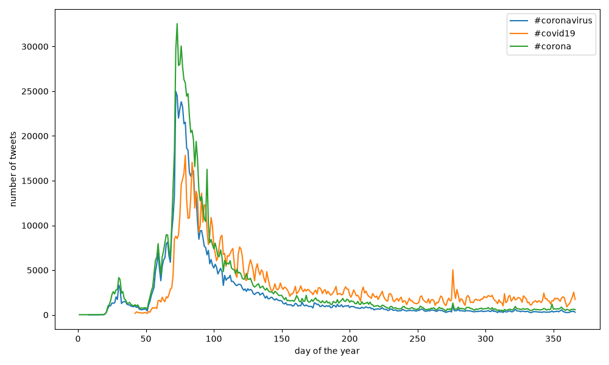

# Coronavirus Twitter Analysis

Scanning all geotagged tweets sent in 2020 to monitor the spread of coronavirus discussion on social media.

## About the Data

Approximately 500 million tweets are sent every day, and about 2% of them are *geotagged* — the user's device includes location information about where the tweet was sent from. This project analyzes all geotagged tweets sent in 2020, roughly 1.1 billion in total.

## Methodology

The tweets are processed with a MapReduce pattern. A map step scans each day's archive independently, counting hashtag usage by language and by country. The  per-day results are written to the `outputs/` folder. A reduce step then combines them into a single set of totals, which are plotted with matplotlib.

## Running It

Map each day's archive in parallel. Each call to `map.py` runs independently, so all of them are launched at once with `nohup` and `&`:

    ./run_maps.sh

This writes one `.lang` and one `.country` file per day into `outputs/`.

Reduce the per-day results into a single set of totals:

    python src/reduce.py --input_paths outputs/*.lang --output_path reduced/reduced.lang
    python src/reduce.py --input_paths outputs/*.country --output_path reduced/reduced.country

Plot the totals for a given hashtag:

    python src/visualize.py --input_path reduced/reduced.lang --key '#coronavirus' --output_path img/reduced.lang.coronavirus.png
    python src/visualize.py --input_path reduced/reduced.country --key '#coronavirus' --output_path img/reduced.country.coronavirus.png
    python src/visualize.py --input_path reduced/reduced.lang --key '#코로나바이러스' --output_path img/reduced.lang.korean.png
    python src/visualize.py --input_path reduced/reduced.country --key '#코로나바이러스' --output_path img/reduced.korean.country.png

Plot daily hashtag usage across the year, reading directly from `outputs/`:

    python src/alternative_reduce.py --hashtags '#coronavirus' '#covid19' '#corona'

All commands are run from the repository root.

## Results

Usage of `#coronavirus`, by language and by country:

 

Usage of `#코로나바이러스` (Korean for *coronavirus*), by language and by country:

 

Daily usage of selected hashtags over the course of the year:

